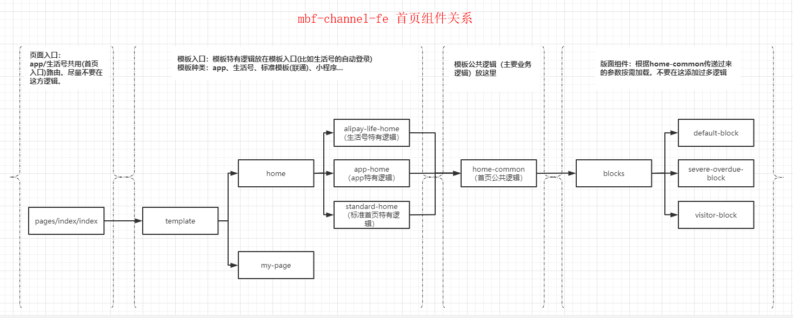

## channel 工程开发规范


### 1、文件命名规范

> - 文件、文件夹名称 尽量不要一个单词（使用一个单词时确保不是 js 关键字或保留关键字）
> - 文件、文件夹名称多个单词用 `-` 连接


### 2、utils、api

> - utils 、 api 统一放在 `src/template/utils` 、`src/template/api`
> - 新增 api 按照页面维度新增（文件夹名称和 pages 下的文件夹保持一致）


### 3、entry

工程运行使用如下脚本：

```
npm run index1
```


### 4、pages/home 下的组件结构引用关系

