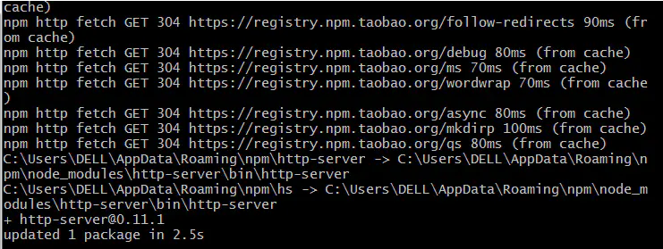
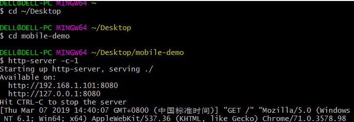

# 使用http-server开启一个本地服务器


我们在写前端页面过程中，经常会用浏览器查看调试自己写的页面是不是达到自己想要的效果，而一般都是编辑器直接打开，用的都是`file`协议.

file协议

 而这种方式是有弊端的 ，当代码中存在http或https的链接时，HTML页面就无法正常打开。 下面教大家一种方法用安装插件打开本地静态服务器。（需要安装Git 和 node.js）


### 方法一：(推荐)

直接在 dist 目录下执行

```
npx http-server
```


### 方法二：

##### 第一步 打开Git Bush 安装 `http-server`插件

   在终端输入命令行  

  ```
  npm i -g http-server
  ```

  Git Bush

安装成功示意图

 

安装成功

##### 第二步 开启 http-server服务

- 命令行 `cd ~/Desktop` 进入桌面

- 命令行 `cd mobile-demo`进入你自己在桌面上创建的项目文件夹

- 命令行 

  ```
  http-server -c-1
  ```

   打开服务器

   输入 下面两个服务器地址 就可以 同步访问自己编写的项目页面了

   

  image.png

  第三步 关闭  http-server服务器

   按快捷键

  ```
  CTRL+C
  ```

   终端显示

  ```
  http-server stopped.
  ```

  即关闭服务器成功。

  

参考文档：https://www.jianshu.com/p/d247f91b1d26