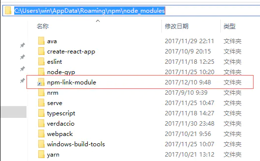

##  如何本地验证npm包


 在本地开发npm模块的时候，我们可以使用npm link命令，将npm 模块链接到对应的运行项目中去，方便地对模块进行调试和测试。

在这里，我们有两个项目，一个是`npm-link-module`，是我们要开发的npm模块,另一个是`npm-link-example`,是我们要运行npm模块的项目

##### 1、首先进入我们的`npm-link-module`项目，执行 npm link 生成调试包

```ruby
cd npm-link-module
npm link
```

执行命令后，npm-link-module会根据package.json上的配置，被链接到全局，路径是`{prefix}/lib/node_modules/`，这是官方文档上的描述，我们可以使用`npm config get prefix`命令获取到prefix的值(不过我这里使用的是windows，实际被链接到的路径是`{prefix}/node_modules/`，不知道是不是npm升级的原因)，如果是win系统的话，实际观察，会发现在`{prefix}/lib/node_modules/`路径下的`node-link-module`是一个快捷方式

 

特别说明：

执行 npm  link 知识生成了一个连接，通常你需要打包你的 npm 包。如：npm run build:component


##### 2、进入`npm-link-example`项目验证我们开发的 npm 包，执行 npm link npm-link-module

```ruby
cd npm-link-example
npm link npm-link-module	// 包名（package.json中的name）
```


##### 项目实践：

 `包名`（package.json中的name） 

```yaml
// 在 npm-link-module 项目
npm link	// 不需要每次都执行
npm run build:component

// 在 npm-link-example 项目验证 npm 包
npm link @mu/lui

// npm-link-example 项目调试完成需要转成线上 npm 包
在npm包中全局：npm unlink 包名
在项目中:npm unlink 包名
```


参考文档：https://www.jianshu.com/p/aaa7db89a5b2


