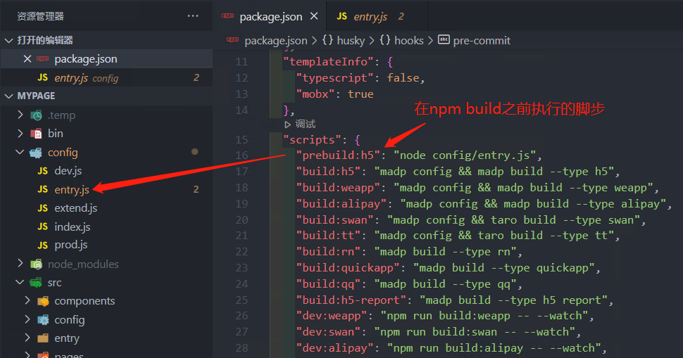
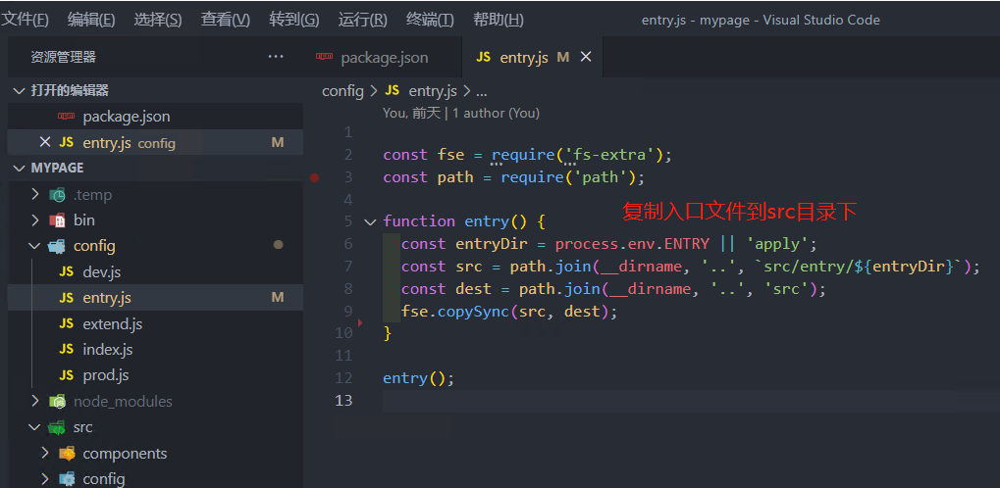

# npm scripts 使用指南


npm 脚本有`pre`和`post`两个钩子。举例来说，`build`脚本命令的钩子就是`prebuild`和`postbuild`。

```json
"prebuild": "echo I run before the build script",
"build": "cross-env NODE_ENV=production webpack",
"postbuild": "echo I run after the build script"
```

用户执行`npm run build`的时候，会自动按照下面的顺序执行。

```json
npm run prebuild && npm run build && npm run postbuild
```

因此，可以在这两个钩子里面，完成一些准备工作和清理工作。下面是一个例子。

```json
"clean": "rimraf ./dist && mkdir dist",
"prebuild": "npm run clean",
"build": "cross-env NODE_ENV=production webpack"
```

即 `npm run prebuild` 和 `npm run postbuild` 是自动执行的。

应用场景：

在 `npm run build` 之前执行一些脚本，可利用 `prebuild`



 


参考文档：http://t.zoukankan.com/mengfangui-p-14659110.html

参考文档（阮一峰）：http://www.ruanyifeng.com/blog/2016/10/npm_scripts.html

