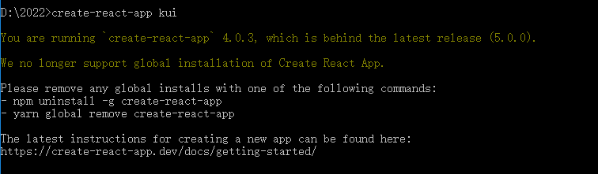

# npx 使用教程


 npm 从5.2版开始，增加了 npx 命令。它有很多用处，本文介绍该命令的主要使用场景。 

npx 主要解决的问题，就是调用项目模块时不再需要全局安装该模块了。本文以常用实例进行说明。


##### 好处

1. 不需要全局安装包
2. 每次使用最新的全局工具包来创建项目


 Node 自带 npm 模块，所以可以直接使用 npx 命令。万一不能用，就要手动安装一下。 

```json
npm install -g npx
```


##### 1、create-react-app 创建工程你会发现推荐你使用 npx

 

出现上述警告直接执行

```
npx create-react-app 工程名称
```


##### 2、使用 npx http-server 开启一个本地服务

即直接在 `dist` 目录下执行

```
npx http-server
```


##### 3、使用 npx 创建 vue3 项目

```json
npx @vue/cli create your-project-name
```


参考文档：http://www.ruanyifeng.com/blog/2019/02/npx.html