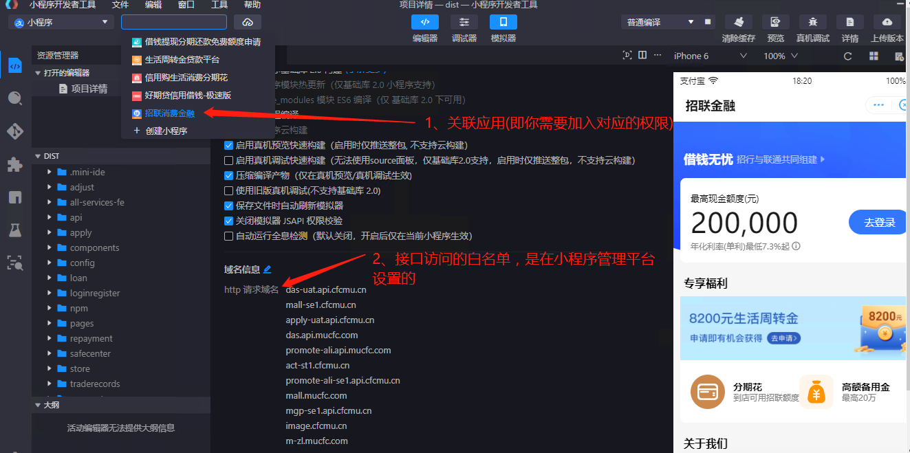
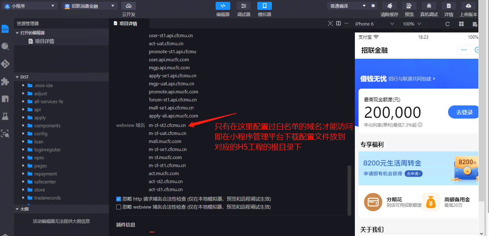
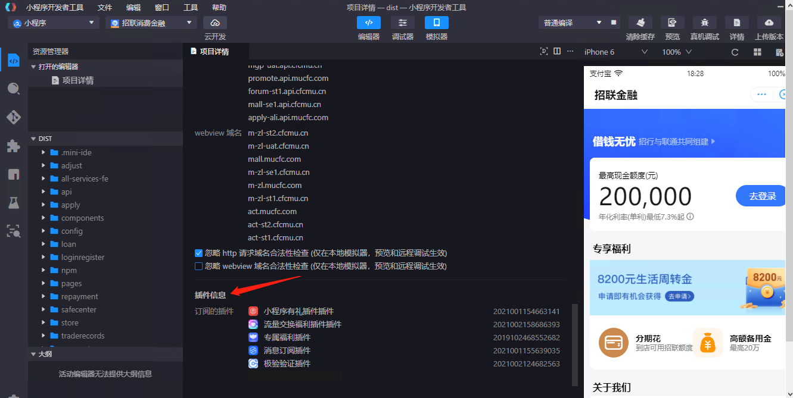

## 支付宝小程序调试注意事项


1. 小程序开发是需要登录后关联应用的，否则将无法打开小程序

   

   

2. 支付宝小程序的 `appid` 没有生产环境和测试环境之分

3. 支付宝接口请求需要配置白名单

4. 支付宝小程序需要配置的 H5 页面需要将小程序配置文件放到目标 H5 工程根目录才能进行访问，否则可能会无法访问。

5. 插件是需要订阅后才能访问的，在小程序管理平台订阅

   

6. 拿到小程序一定要打开 IDE 看看工程基础配置

7. 生活号关注组件用法

   ```js
   import Madp from '@mu/madp';
   import { MUView } from '@mu/zui';
   
   const SCENE_ID = '35377ab33105410695dba94ae6b06126';
   
   export default class AlipayLifeFllow extends Madp.Component {
     constructor(props) {
       super(props);
       this.state = {};
     }
   
     componentDidMount() {
       this.initLifeFollow();
     }
   
     async initLifeFollow() {
       const res = await this.handleImportCDN();
       if (res === 'success') {
         const { lifeFollow } = window;
         const ele = '.alipay-life-follow-node';
         // 场景接入模式
         lifeFollow.render(ele, {
           sceneId: SCENE_ID
         });
       }
     }
   
     handleImportCDN() {
       return new Promise((resolve, reject) => {
         const node = document.createElement('script');
         node.src = 'https://gw.alipayobjects.com/as/g/lifeApp/life-assert-set/0.2.11/lifeFollow.js';
         node.onload = () => {
           resolve('success');
         };
         node.onerror = (e) => {
           reject('fail', e);
         };
         document.body.appendChild(node);
       });
     }
   
   
     render() {
       return <MUView className="alipay-life-follow-node" />;
     }
   }
   ```

   

   