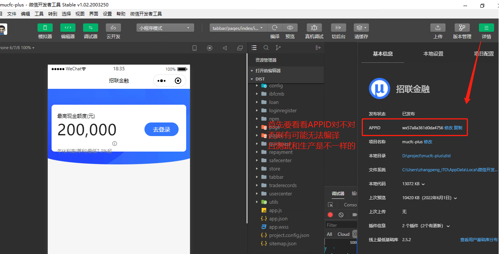
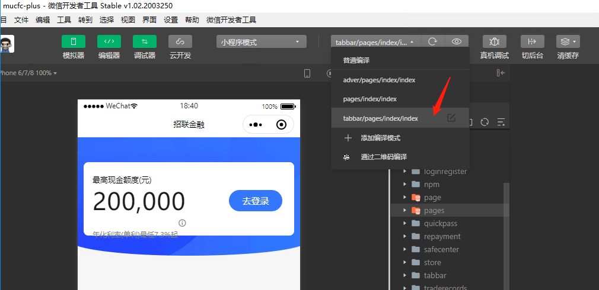
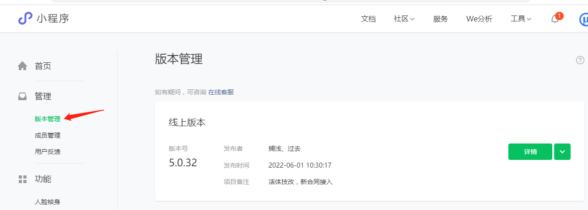

##  微信小程序调试注意事项

1. 首先要获得权限成为开发者
2. 编译时一定要先看看IDE【详情】配置

3. 注意开发环境和生产环境的 APPID是不一样的，对应的管理平台地址也是不一样的

4. 微信小程序是可以指定启动页路由的，包括在管理平台也是可以设置启动页路由的

   

5. 微信小程序管理平台地址，登录时也要选择是测试还是生产

   [访问链接](https://mp.weixin.qq.com/)

6. 在版本管理处设置体验版

   

